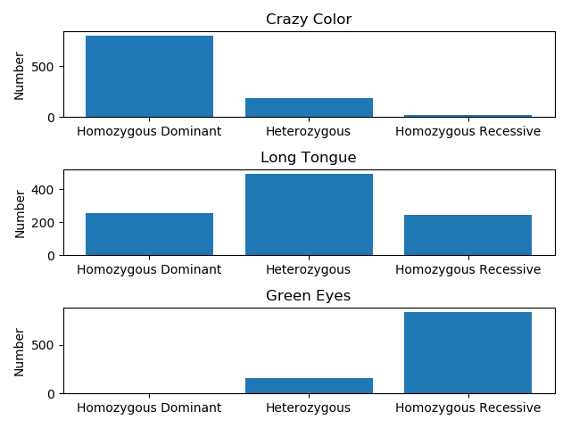

# Static Conditions

These results are support for the Hardy-Weinberg Principle. This is initial allele numbers for this population:

This shows the population over time.

This line graph shows that the population's allele frequencies do not change. This is because the population and evironment satisfy the 4 criteria. They are:

- No selection
- No mutations
- No population migration
- The population is sufficiently large
