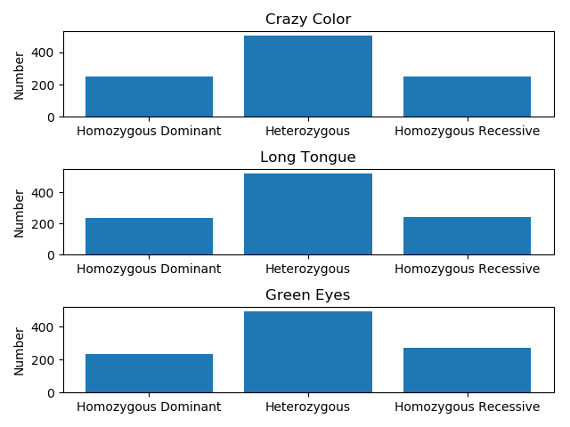

# Evolution Test

## Start.png

## Simulation for Allele Frequencies.png

# Interpretation

For each trait in this population, I set its probability to be dominant to 50%. This is seen in Start.png, which shows that every trait has the same distribution of allele numbers.

However, I set the instant-death chance for the expression of the "Crazy Color" trait to be 80% and the "Long Tongue" trait to be 20%. This is evident in the line graph which shows the frequency of the "Crazy Color" trait dropping rapidly (because any Individual that expresses it is likely to die). Because the death rate for the "Long Tongue" trait is only 20%, it drops much less rapidly than "Crazy Color".
