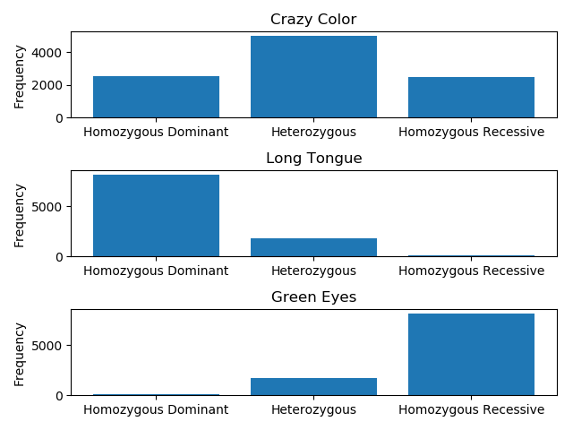

# Sexual Selection working against Evolution

## Start.png

## Allele Frequency Over Time.png

## Constants

-Crazy Color
  - Death Chance = .4
  - Reproductive Points = 10
-Long Tongue
  - Death Chance = .4
  - Reproductive Points = 3
-Green Eyes
  - Death Chance = .0
  - Reproductive Points = 1
	
 # Interpretation

I pitted the forces of sexual selection and evolution against one another. Although it is detrimental for Individuals to have the "Crazy Color" trait, they get mating partners because it is a desirable trait. A real-life example of this is a deer's antlers which can grow ridiculuously long but actually harm the survival of the individual. However, they are a desirable trait for mating, so the trait still exists in populations. 
